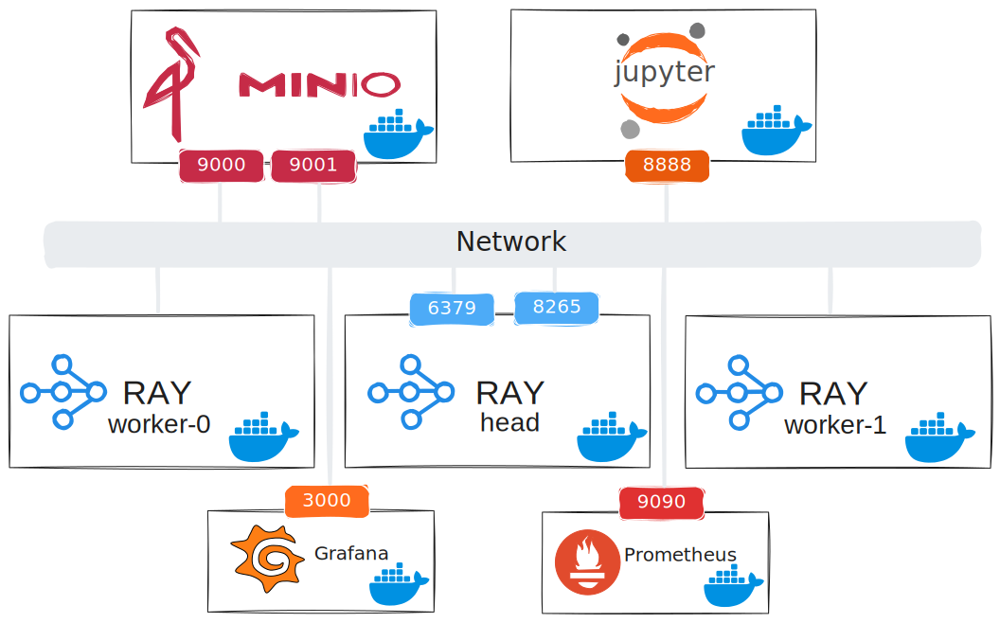

# Train ML models with Ray

In this tutorial, we explore some of the infrastructure and platform requirements for large model training, and to support the training of many models by many teams. We focus specifically on scheduling training jobs on a GPU cluster (using [Ray](https://www.ray.io/)).

To run this experiment, you should have already created an account on Chameleon, and become part of a project. You must also have added your SSH key to the CHI@TACC site.


## Experiment resources 

For this experiment, we will provision one bare-metal node with GPUs. 

This lab requires a node with two GPUs.

We can browse Chameleon hardware configurations for suitable node types using the [Hardware Browser](https://chameleoncloud.org/hardware/). For example, to find nodes with 2x GPUs: if we expand "Advanced Filters", check the "2" box under "GPU count", and then click "View", we can identify some suitable node types. 

We'll proceed with the `gpu_mi100` and `compute_liqid` node types at CHI@TACC.

* Most of the `gpu_mi100` nodes have two AMD MI100 GPUs. (One of the `gpu_mi100` nodes, `c03-04` has only one GPU; we'll avoid this one for the "Ray" section, which requires two GPUs.)
* The `compute_liqid` nodes at CHI@TACC have one or two NVIDIA A100 40GB GPUs. As of this writing, `liqid01` and `liqid02` have two GPUs, so we may use these two for the "Ray" section, which requires two GPUs. 

You can decide which type to use based on availability; but once you decide, make sure to follow the instructions specific to that GPU type. In some parts, there will be different instructions for setting up an AMD GPU node vs. an NVIDIA GPU node.


## Create a lease


To use bare metal resources on Chameleon, we must reserve them in advance. We can reserve a 3-hour block for this experiment.

We can use the OpenStack graphical user interface, Horizon, to submit a lease for an MI100 or Liquid node at CHI@TACC. To access this interface,

* from the [Chameleon website](https://chameleoncloud.org/hardware/)
* click "Experiment" > "CHI@TACC"
* log in if prompted to do so
* check the project drop-down menu near the top left (which shows e.g. “CHI-XXXXXX”), and make sure the correct project is selected.


Then, 

* On the left side, click on "Reservations" > "Leases", and then click on "Host Calendar". In the "Node type" drop down menu, change the type to `gpu_mi100` or `compute_liqid` to see the schedule of availability. You may change the date range setting to "30 days" to see a longer time scale. Note that the dates and times in this display are in UTC. You can use [WolframAlpha](https://www.wolframalpha.com/) or equivalent to convert to your local time zone. 
* Once you have identified an available three-hour block in UTC time that works for you in your local time zone, make a note of:
  * the start and end time of the time you will try to reserve. (Note that if you mouse over an existing reservation, a pop up will show you the exact start and end time of that reservation.)
  * and the name of the node you want to reserve. (We will reserve nodes by name, not by type, to avoid getting a 1-GPU node when we wanted a 2-GPU node.)
* Then, on the left side, click on "Reservations" > "Leases", and then click on "Create Lease":
  * set the "Name" to <code>mltrain_<b>netID</b></code> where in place of <code><b>netID</b></code> you substitute your actual net ID.
  * set the start date and time in UTC. To make scheduling smoother, please start your lease on an hour boundary, e.g. `XX:00`.
  * modify the lease length (in days) until the end date is correct. Then, set the end time. To be mindful of other users, you should limit your lease time to three hours as directed. Also, to avoid a potential race condition that occurs when one lease starts immediately after another lease ends, you should end your lease five minutes before the end of an hour, e.g. at `YY:55`.
  * Click "Next".
* On the "Hosts" tab, 
  * check the "Reserve hosts" box
  * leave the "Minimum number of hosts" and "Maximum number of hosts" at 1
  * in "Resource properties", specify the node name that you identified earlier.
* Click "Next". Then, click "Create". (We won't include any network resources in this lease.)
  
Your lease status should show as "Pending". Click on the lease to see an overview. It will show the start time and end time, and it will show the name of the physical host that is reserved for you as part of your lease. Make sure that the lease details are correct.


Since you will need the full lease time to actually execute your experiment, you should read *all* of the experiment material ahead of time in preparation, so that you make the best possible use of your time.


At the beginning of your lease time, you will continue with the next step, in which you bring up and configure a bare metal instance! Two alternate sets of instructions are provided for this part:

* a notebook that runs in the Chameleon Jupyter interface. This automates the setup process, so that you can "Run > Run Selected Cell and All Below" to let the setup mostly run without human intervention.
* or, instructions for using the Horizon GUI and an SSH session, in case you cannot or prefer not to use the Chameleon Jupyter interface


Before you begin, open this experiment on Trovi:

* Use this link: [Train ML models with Ray](https://chameleoncloud.org/experiment/share/d48d7684-cf6d-4c33-bcd6-5504266bc3d4) on Trovi
* Then, click “Launch on Chameleon”. This will start a new Jupyter server for you, with the experiment materials already in it.


## Launch and set up server - options

The next step will be to provision the bare metal server you have reserved, and configure it to run the containers associated with our experiment. The specific details will depend on what type of GPU server you have reserved - 

* If you have reserved an AMD GPU server, work through the notebook `1_create_server_amd.ipynb` inside the Chameleon Jupyter environment. Or if you don't have access to the Chameleon Jupyter environment or prefer to work through it by hand, you can follow [these instructions to provision and configure the AMD server](snippets/create_server_by_hand_amd.html).
* If you have reserved an NVIDIA GPU server, work through the notebook `1_create_server_nvidia.ipynb`  inside the Chameleon Jupyter environment. Or if you don't have access to the Chameleon Jupyter environment or prefer to work through it by hand, you can follow [these instructions to provision and configure the NVIDIA server](snippets/create_server_by_hand_nvidia.html).

After you have finished setting up the server, you will return to this page for the next section.


## Prepare data

For the rest of this tutorial, we'll be training models on the [Food-11 dataset](https://www.epfl.ch/labs/mmspg/downloads/food-image-datasets/). We're going to prepare a Docker volume with this dataset already prepared on it, so that the containers we create later can attach to this volume and access the data. 


First, create the volume:

```bash
# runs on node-mltrain
docker volume create food11
```

Then, to populate it with data, run

```bash
# runs on node-mltrain
docker compose -f mltrain-chi/docker/docker-compose-data.yaml up -d
```

This will run a temporary container that downloads the Food-11 dataset, organizes it in the volume, and then stops. It may take a minute or two. You can verify with 

```bash
# runs on node-mltrain
docker ps
```

that it is done - when there are no running containers.

Finally, verify that the data looks as it should. Start a shell in a temporary container with this volume attached, and `ls` the contents of the volume:

```bash
# runs on node-mltrain
docker run --rm -it -v food11:/mnt alpine ls -l /mnt/Food-11/
```

it should show "evaluation", "validation", and "training" subfolders.


## Start the Ray cluster

The other major piece of our ML infrastructure and platform is the training job scheduler! When many teams are running training jobs on shared infrastructure, we need to be able to allocate resources among them.

After you finish this section, 

* you should be able to identify the parts of a Ray cluster
* and you should understand how to bring up these parts as Docker containers


### Understand the Ray cluster

Our overall system in this experiment is illustrated in the following image:



- We will operate a Ray cluster with a head node (responsible for scheduling and managing jobs and data, and serving a dashboard), and two worker nodes.
- For observability, the Ray head node uses [Prometheus](https://prometheus.io/) to collect metrics, and [Grafana](https://grafana.com/) to visualize them in a dashboard.
- The Ray worker nodes will use the MinIO object store for persistent storage from jobs. We will save model checkpoints in this MinIO storage, so that if a job is interrupted, a new Ray worker can resume from the last checkpoint.
- In addition to the elements that make up the Ray cluster, we will separately bring up a Jupyter notebook server container, in which we'll submit jobs to the cluster.


Ray is a general framework for programming distributed applications in Python. It is also a platform around this framework that includes many components - 

- Ray Cluster, for managing the underlying hardware resources and scheduling jobs on them
- Ray Train, for training ML models
- Ray Tune, for hyperparameter optimization
- Ray Data, for distributed data processing
- Ray Serve, for serving already-trained models

but we will focus specifically on the first three - Ray Cluster, Ray Train, and Ray Tune.

To bring up the cluster, follow the instructions for the GPU type that you are using - AMD or NVIDIA.


### Start the Ray cluster - AMD GPUs

> **Note**: Follow these instructions only if you are running this experiment on a node with AMD GPUs.

For the Ray experiment, you must use a node with two GPUs. Run

```bash
# run on node-mltrain
rocm-smi
```

and confirm that you see two GPUs.

First, we're going to build a container image for the Ray worker nodes, with Ray and ROCm installed. Run

```bash
# run on node-mltrain
docker build -t ray-rocm:2.54.0 -f mltrain-chi/docker/Dockerfile.ray-rocm .
```

It will take 5-10 minutes to build the container image.

You can see this Dockerfile here: [Dockerfile.ray-rocm](https://github.com/teaching-on-testbeds/mltrain-chi/blob/main/docker/Dockerfile.ray-rocm).


We'll bring up our Ray cluster with Docker Compose. Run:

```bash
# run on node-mltrain
export HOST_IP=$(curl --silent http://169.254.169.254/latest/meta-data/public-ipv4 )
docker compose -f mltrain-chi/docker/docker-compose-ray-rocm.yaml up -d
```

You can see this Docker Compose YAML here: [docker-compose-ray-rocm.yaml](https://github.com/teaching-on-testbeds/mltrain-chi/blob/main/docker/docker-compose-ray-rocm.yaml).


When it is finished, the output of 

```bash
# run on node-mltrain
docker ps
```

should show that the `ray-head`, `ray-worker-0`, and `ray-worker-1` containers are running.

Verify that a GPU is visible to each of the worker nodes.

```bash
# run on node-mltrain
docker exec ray-worker-0 "rocm-smi"
```

and

```bash
# run on node-mltrain
docker exec ray-worker-1 "rocm-smi"
```


### Start the Ray cluster - NVIDIA GPUs

> **Note**: Follow these instructions only if you are running this experiment on a node with NVIDIA GPUs.

For the Ray experiment, you must use a node with two GPUs. Run

```bash
# run on node-mltrain
nvidia-smi
```

and confirm that you see two GPUs.


We'll bring up our Ray cluster with Docker Compose. Run:

```bash
# run on node-mltrain
export HOST_IP=$(curl --silent http://169.254.169.254/latest/meta-data/public-ipv4 )
docker compose -f mltrain-chi/docker/docker-compose-ray-cuda.yaml up -d
```

You can see this Docker Compose YAML here: [docker-compose-ray-cuda.yaml](https://github.com/teaching-on-testbeds/mltrain-chi/blob/main/docker/docker-compose-ray-cuda.yaml).

When it is finished, the output of 

```bash
# run on node-mltrain
docker ps
```

should show that the `ray-head`, `ray-worker-0`, and `ray-worker-1` containers are running.

Although the host has 2 GPUs, we only passed one to each worker. Run

```bash
# run on node-mltrain
docker exec -it ray-worker-0 nvidia-smi --list-gpus
```

and 

```bash
# run on node-mltrain
docker exec -it ray-worker-1 nvidia-smi --list-gpus
```

and confirm that only one GPU appears in the output, and it is a different GPU (different UUID) in each.


### Start a Jupyter container

Next, let's start a Jupyter notebook container that does *not* have any GPUs attached. We'll use this container to submit jobs to the Ray cluster.


```bash
# run on node-mltrain
docker build -t jupyter-ray -f mltrain-chi/docker/Dockerfile.jupyter-ray .
```

Run

```bash
# run on node-mltrain
HOST_IP=$(curl --silent http://169.254.169.254/latest/meta-data/public-ipv4 )
docker run  -d --rm  -p 8888:8888 \
    -v ~/mltrain-chi/workspace_ray:/home/jovyan/work/ \
    -e RAY_ADDRESS=http://${HOST_IP}:8265/ \
    --name jupyter \
    jupyter-ray
```


Then, run 

```bash
# run on node-mltrain
docker exec jupyter jupyter server list
```

and look for a line like

```
http://localhost:8888/lab?token=XXXXXXXXXXXXXXXXXXXXXXXXXXXXXXXXXXXXXXXXXXXXXXXX
```

Paste this into a browser tab, but in place of `localhost`, substitute the floating IP assigned to your instance, to open the Jupyter notebook interface.

In the file browser on the left side, open the `work` directory.

Open a terminal ("File > New > Terminal") inside the Jupyter server environment, and in this terminal, run

```bash
# runs on jupyter container inside node-mltrain
env
```

to see environment variables. Confirm that the `RAY_ADDRESS` is set, with the correct floating IP address.


### Access Ray cluster dashboard

The Ray head node serves a dashboard on port 8265. In a browser, open

```
http://A.B.C.D:8265
```

where in place of `A.B.C.D`, substitute the floating IP associated with your server.

Click on the "Cluster" tab and verify that you see your head node and two worker nodes.


## Submit jobs to the Ray cluster

Now that we have a Ray cluster running, we can learn how to use it! After you finish this section, 

* you should understand how to specify the resource requirements and runtime environment for a job, and submit it to Ray
* and you should be able to modify a Pytorch Lightning script to use Ray Train, including its checkpointing, fault tolerance, and distributed training capabilities, and to use Ray Tune for hyperparameter optimization.


### Submit a job with no modifications

To start, let's see how we can submit a training job to our Ray cluster, without modifying the code of our training job at all.

The premise of this example is as follows: You are working at a machine learning engineer at a small startup company called GourmetGram. They are developing an online photo sharing community focused on food. You have developed a convolutional neural network in Pytorch that automatically classifies photos of food into one of a set of categories: Bread, Dairy product, Dessert, Egg, Fried food, Meat, Noodles/Pasta, Rice, Seafood, Soup, and Vegetable/Fruit. 

An original Pytorch Lightning training script is available at: [gourmetgram-train/train.py](https://github.com/teaching-on-testbeds/gourmetgram-train/blob/lightning/train.py). The model uses a MobileNetV2 base layer, adds a classification head on top, trains the classification head, and then fine-tunes the entire model, using the [Food-11 dataset](https://www.epfl.ch/labs/mmspg/downloads/food-image-datasets/).


Open a terminal inside this Jupyter environment ("File > New > New Terminal") and `cd` to the `work` directory. Then, clone the `lightning` branch of the [gourmetgram-train](https://github.com/teaching-on-testbeds/gourmetgram-train/) repository:

```bash
# run in a terminal inside jupyter container
cd ~/work
git clone https://github.com/teaching-on-testbeds/gourmetgram-train -b lightning
```

In the `gourmetgram-train` directory, open `train.py`, and view it directly there.


To run it on a worker node, though, we must give Ray some instructions about how to set up the runtime environment on the worker nodes. Two files necessary for this, `requirements.txt` and `runtime.json`, are inside the "work" directory:

* We assume that the worker nodes already have the Food-11 dataset at `/mnt/Food-11`, since we attached our data volume to those containers. So we don't have to worry about getting the data to the worker node in this case. We will have to make sure that the environment variable `FOOD11_DATA_DIR` is set, so that the training script can find the data. (In general, we will need to make sure that either worker nodes have access to the data, or they download it at the beginning of the training job.)
* We need to make sure that the worker nodes have the Python packages necessary to run our script. We'll put the list of packages in `requirements.txt`.
* And, we need to direct Ray to run this on a GPU node.

In `runtime.json`:

```json
{
    "pip": "requirements.txt",
    "env_vars": {
        "FOOD11_DATA_DIR": "/mnt/Food-11"
    }
}
```

we specify that when setting up a worker node to run our job, Ray should:

* install the Python packages listed in `requirements.txt`
* and set the `FOOD11_DATA_DIR` directory.

With this in hand, we can submit our job! In a terminal inside the Jupyter environment, run

```bash
# runs on jupyter container inside node-mltrain, from inside the "work" directory
ray job submit --runtime-env runtime.json --entrypoint-num-gpus 1 --entrypoint-num-cpus 8 --verbose  --working-dir .  -- python gourmetgram-train/train.py 
```

where we pass 

* the runtime environment specification, 
* the number of GPUs and CPUs our job requires, 
* we specify that we would like to see verbose output, 
* that the current working directory should be packaged up and shipped to the worker nodes,
* and that the command to run is: `python gourmetgram-train/train.py`.

While it is running, click on the "Overview", "Cluster", and "Jobs" tabs in the Ray dashboard.

* Initially, the job will be in PENDING state, as the runtime environment is set up. This is slow the first time (because of downloading the Python packages), but faster in subsequent runs because the packages are cached on the workers.
* Then, the job will be in RUNNING state. Eventually, it should go to SUCCEEDED.
* You will see the job's requested GPU and CPU resource in the "Resource Status" section of the "Overview" page, which shows the cumulative resource requests of all jobs running on the cluster.
* As the job runs, you'll see one of the worker nodes has high GPU utilization, in the "Cluster" tab. 
* You can click on the job and, in the "Logs", see the output of the job.

Let the training job finish, and get to SUCCEEDED state. (This may take up to 10-15 minutes.)


### Submit an infeasible job

Next, let's see what happens if we submit a job for which there is no node that satisfies the resource requirements. Run

```bash
# runs on jupyter container inside node-mltrain, from inside the "work" directory
ray job submit --runtime-env runtime.json --entrypoint-num-gpus 2 --entrypoint-num-cpus 8 --verbose  --working-dir .  -- python gourmetgram-train/train.py 
```

noting that we have no node with 2 GPUs - only two nodes, each with 1 GPU. 

In the Ray dashboard "Overview" page, observe that this request is listed in "Demands" in the "Resource Status" section.

The job will be stuck in PENDING state until we add a node with 2 GPUs to the cluster, at which time it can be scheduled.

In a commercial cloud, when deployed with Kubernetes, a Ray cluster could [autoscale](https://docs.ray.io/en/latest/cluster/vms/user-guides/configuring-autoscaling.html) in this situation to accommodate the demand that could not be satisfied. Our cluster is not auto-scaling and we are not going to add a node with 2 GPUs, so this job will wait forever.

Use Ctrl+C to stop the process in the Jupyter terminal. (The job is still submitted and PENDING, but not consuming worker resources, since it cannot be scheduled.)


### Use Ray Train

While this is enough to run training jobs on the cluster, we're not making full use of Ray by running jobs this way. We can use Ray Train's [`TorchTrainer`](https://docs.ray.io/en/latest/train/getting-started-pytorch-lightning.html) to get additional features, including:

* fault tolerance - we'll save checkpoints in a MinIO object store and, if the worker node assigned to a job dies, it will resume training from the most recent checkpoint on a different worker.
* distributed training across different workers in the cluster (they can even be on different hosts! Although in this experiment, we're not using different hosts because it makes reservations complicated.)
* and, together with Ray Tune, intelligent hyperparameter optimization.

It is simple to [wrap a Pytorch Lightning script with Ray Train](https://docs.ray.io/en/latest/train/getting-started-pytorch-lightning.html). Run

```bash
# run in a terminal inside jupyter container
cd ~/work/gourmetgram-train
git stash # stash any changes you made to the current branch
git fetch -a
git switch ray
cd ~/work
```

The `train.py` script in this branch has already been modified for Pytorch Lightning. Open it, and note that we have:

* added imports
* wrapped *all** the Lightning code in a `def train_func(config)` block
* changed our `Lightning` trainer from 

```python
trainer = Trainer(
    max_epochs=config["total_epochs"],
    accelerator="gpu",
    devices="auto",
    callbacks=[checkpoint_callback, early_stopping_callback, backbone_finetuning_callback]
)
```

to use Ray-specific functions for checkpointing and distributed training,

```python
trainer = Trainer(
    max_epochs=config["total_epochs"],
    devices="auto",
    accelerator="auto",
    strategy=ray.train.lightning.RayDDPStrategy(),
    plugins=[ray.train.lightning.RayLightningEnvironment()],
    callbacks=[early_stopping_callback, backbone_finetuning_callback, ray.train.lightning.RayTrainReportCallback()]
)
trainer = ray.train.lightning.prepare_trainer(trainer)

```

At the end, we run the training function with

```python
run_config = RunConfig(storage_path="s3://ray")
scaling_config = ScalingConfig(num_workers=1, use_gpu=True, resources_per_worker={"GPU": 1, "CPU": 8})
trainer = TorchTrainer(
    train_func, scaling_config=scaling_config, run_config=run_config, train_loop_config=config
)
result = trainer.fit()
```

Here, 

* the `RunConfig` specifies where to put checkpoint files - we have created a MinIO bucket named `ray` for this. The MinIO credentials are passed to the Ray containers as environment variables in the Docker Compose. We also specify what to do if a job fails (we'll get to that soon!)
* the `ScalingConfig` defines the cluster resources we are going to request.
* and, we pass it all to a `Ray` `TorchTrainer`.


Let's try our Ray Train script. Since we define the resource requirements in the script itself, we **won't** use `--entrypoint-num-gpus` or `--entrypoint-num-cpus` this time - 


```bash
# runs on jupyter container inside node-mltrain, from inside the "work" directory
ray job submit --runtime-env runtime.json  --working-dir .  -- python gourmetgram-train/train.py 
```

Submit the job, and note that it runs mostly as before. Let it run until it is finished.


### Use Ray Train with multiple workers

This version of our Ray Train script doesn't improve much on the previous way of directly submitting a Pytorch or Pytorch Lightning job, but it can!

We can easily use Ray Train to scale to multiple nodes. In `train.py`, change

```python
scaling_config = ScalingConfig(num_workers=1, use_gpu=True, resources_per_worker={"GPU": 1, "CPU": 8})
```

to 

```python
scaling_config = ScalingConfig(num_workers=2, use_gpu=True, resources_per_worker={"GPU": 1, "CPU": 8})
``` 

to scale to two worker nodes, each with 1 GPU and 8 GPUs assigned to the job. Save it, and run with

```bash
# runs on jupyter container inside node-mltrain, from inside the "work" directory
ray job submit --runtime-env runtime.json  --working-dir .  -- python gourmetgram-train/train.py 
```

On the Ray dashboard, in the "Resource Status" section of the "Overview" tab, you should see the increased resource requirements reflected in the "Usage" section.

In a terminal on the "node-mltrain" host (*not* inside the Jupyter container), run

```bash
# runs on node-mltrain
nvtop
```

and confirm that both GPUs are busy.


### Use Ray Train with fractional GPUs

Just as we scaled up, we can scale down - we can ask for fractional GPUs. Ray won't enforce that a process only uses a fraction of the GPU, but if we know that a process does not fully utilize the GPU, we can specify fractional resources and then we can pack more processes on the same workers.

In `train.py`, change

```python
scaling_config = ScalingConfig(num_workers=2, use_gpu=True, resources_per_worker={"GPU": 1, "CPU": 8})
```

to 

```python
scaling_config = ScalingConfig(num_workers=1, use_gpu=True, resources_per_worker={"GPU": 0.5, "CPU": 4})
``` 

i.e. set the number of workers back to 1, and reduce the resources per worker. 


Then, open *three* terminals inside the Jupyter container. You are going to start three training jobs at the same time.

In each of the terminals, run


```bash
# runs on jupyter container inside node-mltrain, from inside the "work" directory
cd ~/work
ray job submit --runtime-env runtime.json  --working-dir .  -- python gourmetgram-train/train.py 
```

to submit the job three times.

On the Ray dashboard, in the "Resource Status" section of the "Overview" tab, you should see the total resource requirements reflected in the "Usage" section.


In a terminal on the "node-mltrain" host (not inside the container), run

```bash
# runs on node-mltrain
nvtop
```

to observe the effect on GPU utilization. You should be able to visually identify the GPU that has two jobs running on it, vs. the GPU that has only one. 

Wait for the training jobs to finish, and note the total time required to run 3 training jobs. (This is the time from "start of first job" until "end of last job to finish".) Since these jobs originally did not utilize a full GPU, they aren't slowed down much by sharing a GPU. 

Fractional GPU use allows us to increase the throughput of the cluster - it won't reduce the time to complete any one job, but if GPUs are underutilized, it can increase the number of jobs completed per unit time.


### Use Ray Train for fault tolerance

Next, let's try out fault tolerance! If the worker node that runs our Ray Train job dies, Ray can resume from the most recent checkpoint on another worker node.

Fault tolerance is configured in another branch

```bash
# run in a terminal inside jupyter container
cd ~/work/gourmetgram-train
git stash # stash any changes you made to the current branch
git fetch -a
git switch fault_tolerance
cd ~/work
```

To add fault tolerance, we

* have an additional import
* add it to our `RunConfig`:

```python
run_config = RunConfig( ... failure_config=FailureConfig(max_failures=2))
```

And inside `train_fun`, we replace the old

```python
trainer.fit(lightning_food11_model, train_dataloaders=train_loader, val_dataloaders=val_loader)
```

with

```python
## For Ray Train fault tolerance with FailureConfig
# Recover from checkpoint, if we are restoring after failure
checkpoint = train.get_checkpoint()
if checkpoint:
    with checkpoint.as_directory() as ckpt_dir:
        ckpt_path = os.path.join(ckpt_dir, "checkpoint.ckpt")
        trainer.fit(lightning_food11_model, train_dataloaders=train_loader, val_dataloaders=val_loader, ckpt_path=ckpt_path)
else:
        trainer.fit(lightning_food11_model, train_dataloaders=train_loader, val_dataloaders=val_loader)

```

So, let's create a failure to see how it works! Run

```bash
# runs on jupyter container inside node-mltrain, from inside the "work" directory
ray job submit --runtime-env runtime.json  --working-dir .  -- python gourmetgram-train/train.py 
```

to submit the job.

Wait until about half of the epochs have passed (e.g. about 10 epochs), so that there is a checkpoint to resume from.

In a terminal on the "node-mltrain" host (not inside the container), run

```bash
# runs on node-mltrain
nvtop
```

and identify whether the job is assigned to GPU 0 or GPU 1. Keep monitoring the `nvtop` output as you bring up a second terminal on "node-mltrain".

In that second terminal bring down the Docker container in which you Ray Train job is running (`ray-worker-0` has GPU 0 and `ray-worker-1` has GPU 1) - run one of these two commands -

```bash
# runs on node-mltrain
# docker stop ray-worker-0
# docker stop ray-worker-1
```

Observe in the `nvtop` output that the job is transferred to the other GPU. (Take a screenshot for your reference, during the interval when GPU usage is visible on both GPUs, showing the job transfer.) 

And, in the `ray job submit` output, you will see something like

```
(TorchTrainer pid=516, ip=172.19.0.4) Worker 0 has failed.
...
(TorchTrainer pid=512, ip=172.19.0.5) Restored on 172.19.0.5 from checkpoint: Checkpoint(filesystem=py::fsspec+('s3', 's3a'), path=ray/TorchTrainer_2025-02-25_17-47-34/TorchTrainer_a64e2_00000_0_2025-02-25_17-47-34/checkpoint_000004)
````

as the job switches to the other worker and resumes from checkpoint.

On the "Overview" page in the Ray dashboard, check the "Cluster status and autoscaler" visualization, and node that the node count has gone down. 

Wait for the training job to finish. 

Re-start the worker you stopped with one of - 

```bash
# runs on node-mltrain
# docker start ray-worker-0
# docker start ray-worker-1
```


### Optional: Use Ray Tune for hyperparameter optimization

Finally, let's try using Ray Tune! Ray Tune makes it easy to run a distributed hyperparamter optimization, with intelligent scheduling e.g. aborting runs that are not looking promising. 

Switch to the `tune` branch to see this version of the code - 

```bash
# run in a terminal inside jupyter container
cd ~/work/gourmetgram-train
git stash # stash any changes you made to the current branch
git fetch -a
git switch tune
cd ~/work
```

In this version of the code,

* we have added some new imports
* we made some changes to our `config` to specify the hyperparameters we want to tune. We will consider two batch sizes, and we will randomly sample different dropout probabilities:

```
config = {
    "batch_size": tune.choice([32, 64]),
    "dropout_probability": tune.uniform(0.1, 0.8),
    ...
```

* the `config` is not passed directly to the `trainer` anymore, 
* and, instead of calling `fit` on `trainer`, we wrap our trainer in a Tune function, and `fit` that. We are using `ASHAScheduler`, a kind of [hyperband](https://arxiv.org/abs/1603.06560) scheduler which early-stops less promising runs:

```python

### New for Ray Tune
def tune_asha(num_samples:
    scheduler = ASHAScheduler(max_t=config["total_epochs"], grace_period=1, reduction_factor=2)
    tuner = tune.Tuner(
        trainer,   # this is the original trainer!
        param_space={"train_loop_config": config},  # pass our config here instead
        tune_config=tune.TuneConfig(
            metric="val_accuracy",
            mode="max",
            num_samples=num_samples,
            scheduler=scheduler,
        ),
    )
    return tuner.fit()


results = tune_asha(num_samples=16)
```


Run

```bash
# runs on jupyter container inside node-mltrain, from inside the "work" directory
ray job submit --runtime-env runtime.json  --working-dir .  -- python gourmetgram-train/train.py 
```

to submit the job.


The initial output (which is also available from the job logs in the Ray dashboard, if you miss it in the terminal!) will show you which configurations were randomly samples, and it will start 8 training samples to evaluate those configurations.

However, as the training job progresses, you will see that some jobs are "TERMINATED" in fewer than 20 epochs, because other hyperparameter configurations were judged more effective. This saves resources on the cluster, compared to a grid search or a random search.


### Stop Ray system

When you are finished with this section, stop the Ray cluster and its associated pieces (Grafana, object store).

For AMD GPUs:

```bash
# run on node-mltrain
docker compose -f mltrain-chi/docker/docker-compose-ray-rocm.yaml down
```

For NVIDIA GPUs:

```bash
# run on node-mltrain
docker compose -f mltrain-chi/docker/docker-compose-ray-cuda.yaml down
```

and then stop the Jupyter server with

```bash
# run on node-mltrain
docker stop jupyter
```


<hr>

<small>Questions about this material? Contact Fraida Fund</small>

<hr>

<small>This material is based upon work supported by the National Science Foundation under Grant No. 2230079.</small>

<small>Any opinions, findings, and conclusions or recommendations expressed in this material are those of the author(s) and do not necessarily reflect the views of the National Science Foundation.</small>